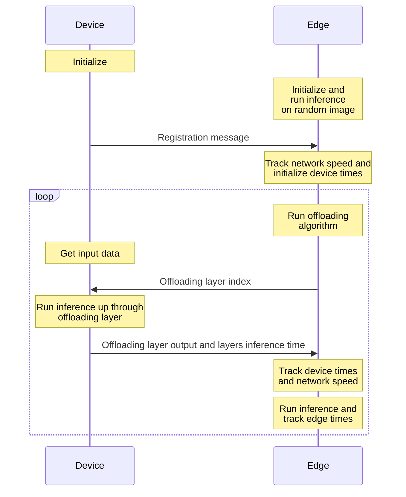

# ESP32 Neural Network Offloading with MQTT

This project demonstrates offloading neural network computations from an `ESP32-S3-EYE` device to an edge server using MQTT. The ESP32 device connects to a Wi-Fi network, registers itself on the edge server, and communicates through MQTT topics to perform neural network inference layer by layer.

## Features

- **Wi-Fi Connectivity:** The ESP32 connects to a specified Wi-Fi network.
- **MQTT Communication:** The ESP32 uses MQTT to send and receive messages from an edge server.
- **Neural Network Offloading:** Inference layers are run on the ESP32, and results are sent to the edge server.
- **TensorFlow Lite Micro:** The project utilizes TensorFlow Lite Micro for running machine learning models on the ESP32.
- **NTP Time Synchronization:** The device syncs with an NTP server for accurate timestamps.
- **UUID Generation:** Each message and device is uniquely identified using UUIDs.

## Dependencies

- **ESP32 Board Support Package** (via Arduino IDE)
- **Libraries:**
  - `WiFi.h`: For Wi-Fi connectivity.
  - `AsyncMqttClient.h`: For MQTT communication.
  - `ArduinoJson.h`: For handling JSON data.
  - `tensorflow/lite/micro`: For running TensorFlow Lite models on microcontrollers.
  - `UUID.h`: For generating UUIDs.

## Configuration

Edit the `conf.h` file to set up the following configurations:

- **Wi-Fi Credentials:** `SSID` and `PWD`
- **MQTT Broker:** `MQTT_SRV`, `MQTT_PORT`
- **NTP Server:** `NTP_SRV`, `NTP_GMT_OFFSET`, `NTP_DAYLIGHT_OFFSET`
- **Model:** `MAX_NUM_LAYER`, `BATCH_SIZE`, `IMAGE_HEIGHT`, `IMAGE_WIDTH`, `CHANNELS`, `MAX_ELEMENTS_PER_MODEL_LAYER`, `K_TENSOR_ARENA_SIZE`, `WDT_TIMEOUT`

## Model Setup

The project supports TensorFlow Lite models, which are loaded and run sequentially. Each layer is defined in its own header file (e.g., `layer_0.h`, `layer_1.h`).

Ensure that the TensorFlow Lite model layers are properly converted and placed in the `model_layers` directory.

## Board setup

PlatformIO board configuration for `ESP32-S3-EYE` (8 MB Octal PSRAM and a 8 MB flash):

```json
{
  "build": {
    "arduino": {
      "partitions": "default_8MB.csv",
      "memory_type": "qio_opi"
    },
    "core": "esp32",
    "extra_flags": [
      "-DARDUINO_ESP32S3_DEV",
      "-DARDUINO_RUNNING_CORE=1",
      "-DARDUINO_EVENT_RUNNING_CORE=1",
      "-DBOARD_HAS_PSRAM"
    ],
    "f_cpu": "240000000L",
    "f_flash": "80000000L",
    "flash_mode": "qio",
    "psram_type": "opi",
    "hwids": [
      [
        "0x303A",
        "0x1001"
      ]
    ],
    "mcu": "esp32s3",
    "variant": "esp32s3"
  },
  "connectivity": [
    "wifi",
    "bluetooth"
  ],
  "debug": {
    "default_tool": "esp-builtin",
    "onboard_tools": [
      "esp-builtin"
    ],
    "openocd_target": "esp32s3.cfg"
  },
  "frameworks": [
    "arduino",
    "espidf"
  ],
  "platforms": [
    "espressif32"
  ],
  "name": "Espressif ESP32-S3-DevKitC-1-N8R8 (8 MB Flash Quad, 8 MB PSRAM Octal)",
  "upload": {
    "flash_size": "8MB",
    "maximum_ram_size": 327680,
    "maximum_size": 8388608,
    "require_upload_port": true,
    "speed": 921600
  },
  "url": "https://docs.espressif.com/projects/esp-idf/en/latest/esp32s3/hw-reference/esp32s3/user-guide-devkitc-1.html",
  "vendor": "Espressif"
}
```

Copy it in a `esp32-s3-devkitc-1-n8r8.json` file a save it in `~/.platformio/platforms/espressif32/boards` to make it available on PlatformIO. For more [boards](https://github.com/sivar2311/platformio_boards.git).

## Topics

The following MQTT topics are used for communication:

- `devices/`: Topic to send device registration.
- `DeviceUUID/offloading_layer`: Topic to receive best offloading layer.
- `DeviceUUID/input_data`: Topic to send input data.
- `DeviceUUID/model_inference_result`: Topic to send inference results.

## Running the Project

1. Flash the code to the ESP32.
2. Ensure that the MQTT broker is running and accessible.
3. The device will:
   - Connect to Wi-Fi.
   - Register itself on the edge server.
   - Subscribe to necessary MQTT topics.
   - Perform neural network inference layer by layer and offload based on index from `DeviceUUID/offloading_layer`.

## Example Workflow



1. **Device Registration:** The ESP32 registers itself to the edge server by publishing a registration message.
2. **Receive Input Data:** The device receives best offloading layer index for the neural network through the `offloading_layer` topic.
3. **Run Inference:** The device runs inference for each layer of the neural network up to offloading layer and publishes the results to the `model_inference_result` topic.
4. **Publish Results:** Inference results, including the output and inference time for each layer, are published on the edge server.

## Notes

- The ESP32 must be equipped with enough PSRAM to hold `inputBuffer`, `tensor_arena`, `output_message`, `lastMultiOutputLayerData`, `fb`, `jsonDoc` and `doc`
- The ESP32 can work standalone, but it will perdiodically try to connect to an edge server on `devices/`, so ensure that the server is properly configured to handle incoming MQTT messages and process the neural network inference results.
